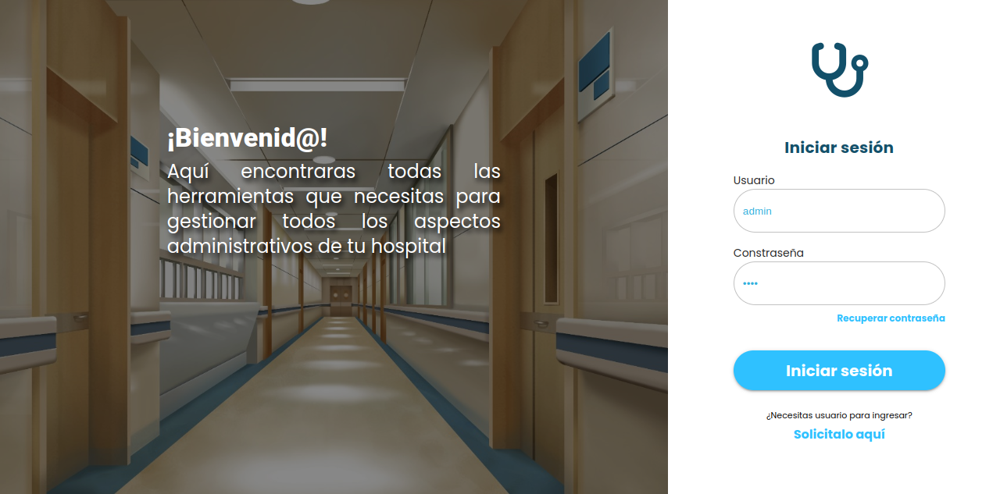

<p align="center">
  <a href="https://kney28.github.io/" target="blank"></a>
</p>

  <p align="center">Backend construido con <a href="https://nestjs.com/">Nestjs.</a></p>

## Descripción

Este es el backend de un sistema ERP (que aún se encuentra en construcción) diseñado específicamente para la gestión eficiente de hospitales y centros de atención médica. Proporciona una variedad de funcionalidades para optimizar las operaciones internas y mejorar la atención al paciente.

Estaré subiendo nuevas funcionalidades constantemente.

## Funcionalidades Principales

- **Gestión de Usuarios y Roles:** Permite la autenticación y autorización de diferentes tipos de usuarios, con diferentes niveles de acceso y permisos.
  
- **Gestión de Pacientes:** Registra y gestiona la información de los pacientes, incluyendo historias clínicas, citas, tratamientos y medicaciones.

- **Gestión de Recursos e Inventario:** Administra los equipos médicos, suministros, medicamentos y otros materiales necesarios para la atención médica.

- **Gestión Financiera:** Administra aspectos financieros como facturación, cobros, pagos, seguros médicos y contabilidad general.

> **Nota:** recuerda clonar el repo del frontend. <a href="https://github.com/kney28/erp-demo-frontend">Go.</a>

## Instalación

```bash
$ npm install
```

## Configuración

<p>Deberás tener una base de datos PostgreSQL.</p>
<p>Solo deberas modificar el archivo `.env.example` con la info de tu base de datos postgreSQL.</p>

```ini
  PORT = '3000'
  TYPE = 'postgres'
  HOST = '127.0.0.1'
  PORT_DB = '5472'
  USERNAME_DB = 'myUser'
  PASSWORD_DB = 'myPassword'
  DATABASE = 'myDataBase'
  AUTOLOADENTITIES = 'true'
  SYNCHRONIZE = 'true'
```

<p>Una vez modificado guárdalo como .env y listo.</p>

## Ejecutar la app

```bash
# development
$ npm run start
```
